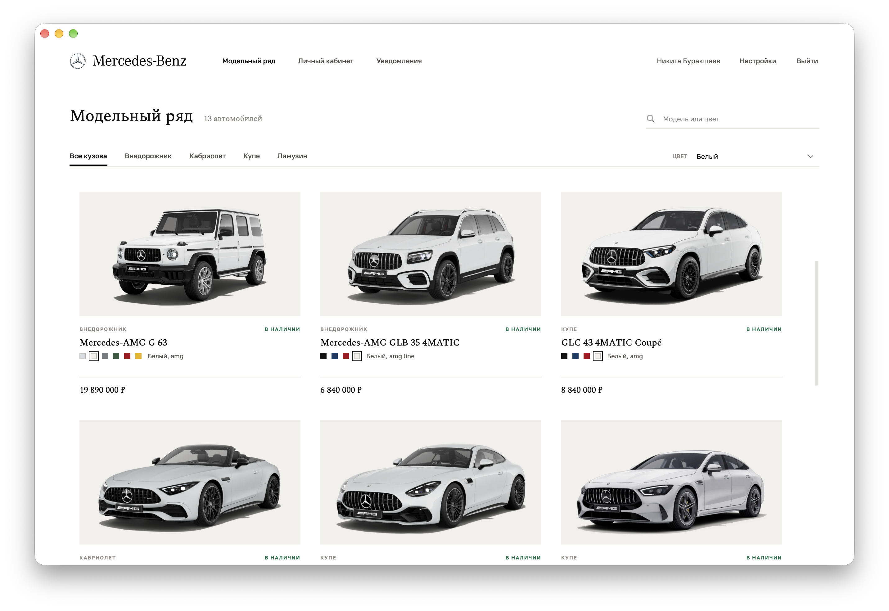
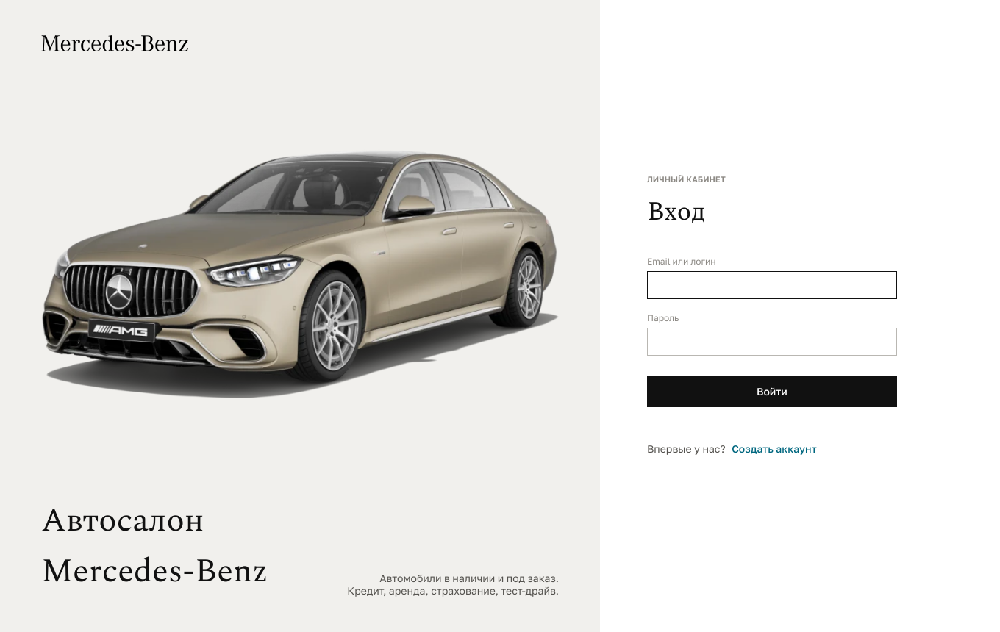
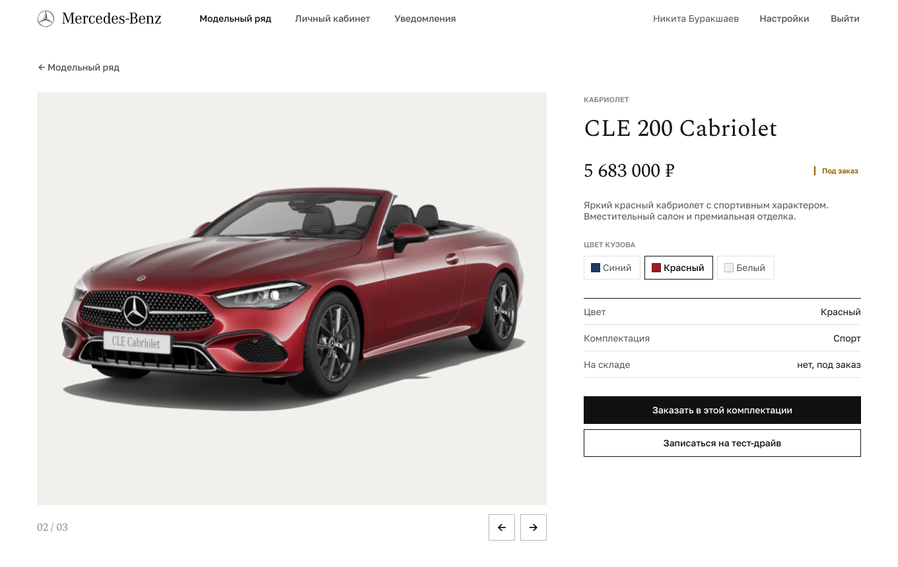
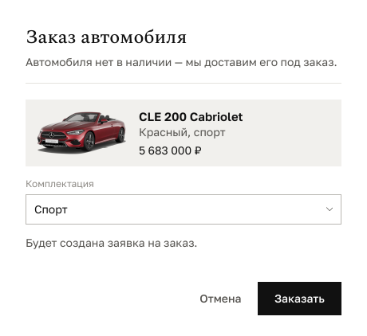
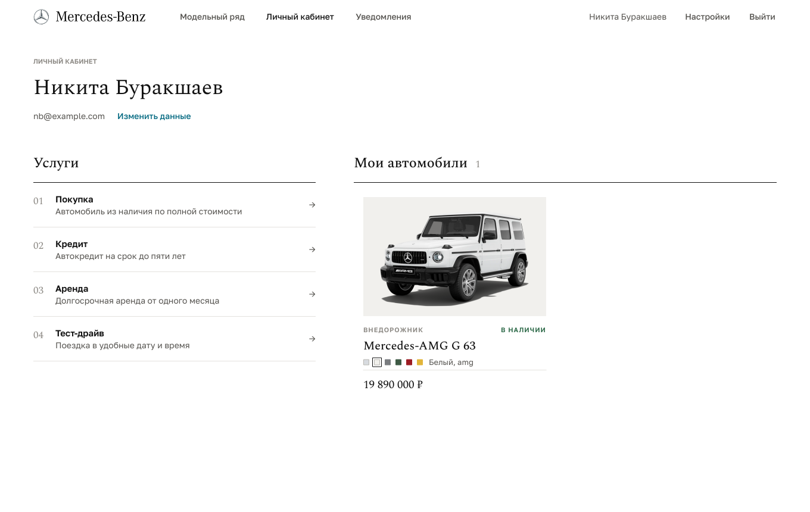
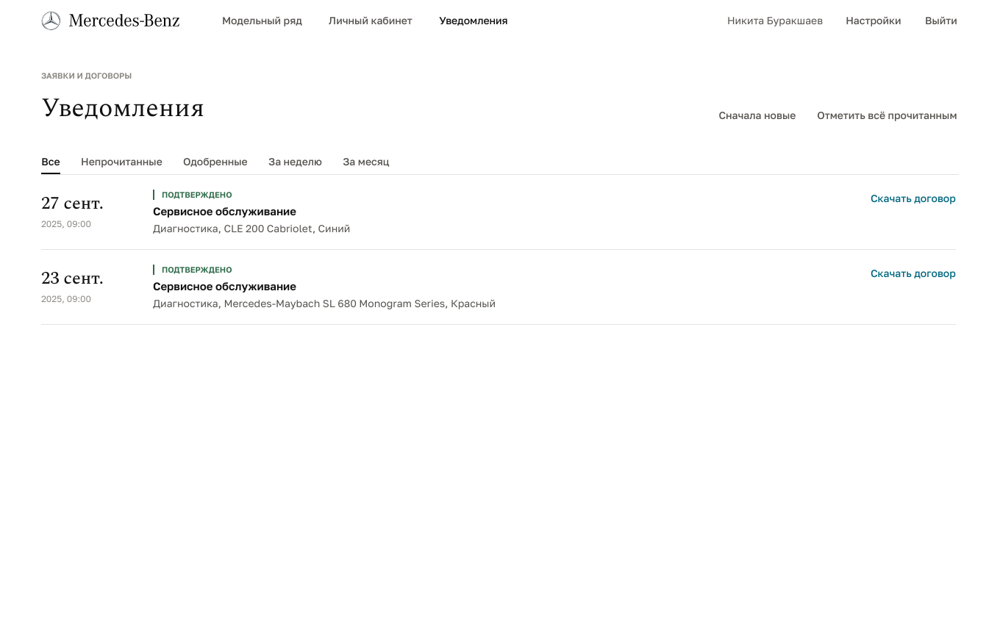
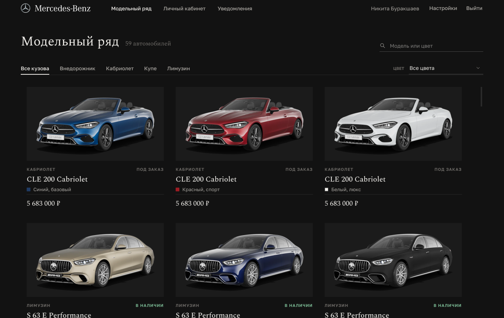
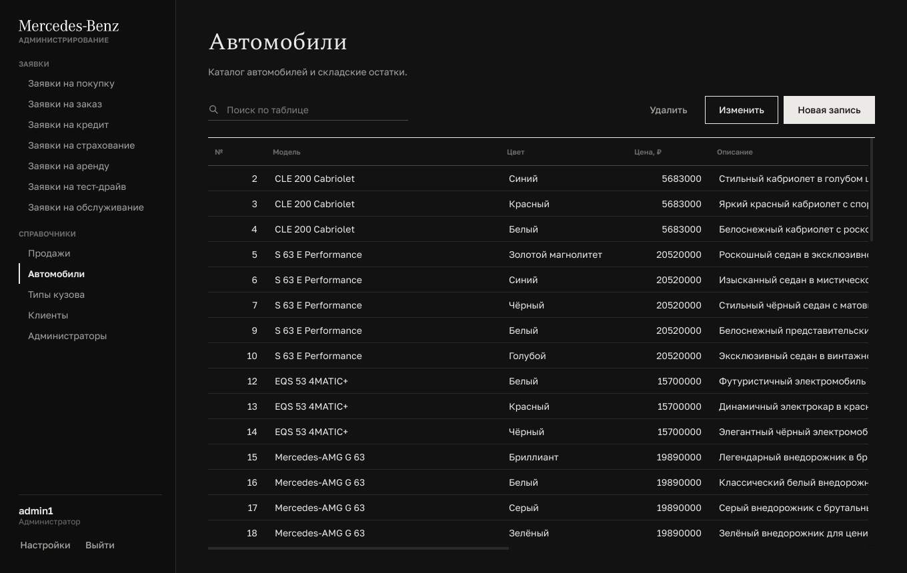

# Десктоп-приложение «Автосалон Mercedes-Benz»


Клиент автосалона на **Qt Widgets** со встроенной базой **SQLite**: каталог, заявки на покупку, заказ,
кредит, аренду, страхование и тест-драйв, уведомления со статусами и экспорт договоров, а также
панель администратора для обработки заявок и редактирования справочников.

<p align="center"></p>

## Возможности

**Клиент**
- каталог с поиском, фильтрами по типу кузова и цвету, адаптивной сеткой карточек;
- карточка автомобиля: все цвета модели, комплектация, наличие на складе;
- оформление заявки (покупка / кредит / аренда + страховка) в одной транзакции, заказ отсутствующей комплектации, запись на тест-драйв;
- личный кабинет с купленными автомобилями и быстрым доступом к услугам;
- уведомления о смене статуса заявок, фильтры, экспорт договора в PDF / HTML;
- редактирование профиля, светлая и тёмная темы.

**Администратор**
- заявки всех типов с одобрением / отклонением (одобрение покупки списывает автомобиль со склада триггером БД);
- редактирование таблиц (автомобили, типы кузова, клиенты, администраторы, продажи) с проверкой ограничений на стороне SQLite;
- поиск и сортировка по любой таблице, сумма продаж.

## Сборка и запуск

Требования: Qt ≥ 6.5 (модули Widgets, Sql, Test), CMake ≥ 3.19, компилятор C++20.
Внешний сервер БД не нужен: используется драйвер `QSQLITE`, входящий в Qt.

```bash
cmake -S . -B build -DCMAKE_PREFIX_PATH=/path/to/Qt/6.x/<compiler>
cmake --build build --parallel
./build/qt-car-dealership            # БД создаётся автоматически
ctest --test-dir build --output-on-failure
```

Файл базы данных при первом запуске создаётся и мигрируется в
`QStandardPaths::AppDataLocation` (например, `~/.local/share/burakshaevn/qt-car-dealership/dealership.sqlite`).
Путь можно переопределить ключом `--database <path>` или переменной окружения `CAR_DEALERSHIP_DB`.

Тестовые учётные записи (из `003_seed_data.sql`):

| Роль          | Логин            | Пароль        |
|---------------|------------------|---------------|
| Клиент        | `nb@example.com` | `password123` |
| Администратор | `admin1`         | `password123` |

## Архитектура

```
system_data/            SQL-слой (статическая библиотека + Qt-ресурсы)
  sql/migrations/       NNN_*.sql — схема, представления, триггеры, начальные данные, конфигурация
  sql/queries/<group>/  по одному запросу в файле, только именованные параметры (:client_id)
  sql/bootstrap/        служебные скрипты (PRAGMA, журнал миграций)
  include/SqlQueries.h  логические имена запросов: SqlQuery::Products::kSelectAll → products/select_all.sql
src/model/              DatabaseHandler, DatabaseMigrator, репозитории, модели Qt (ProductListModel, AdminTableModel)
src/view/               ThemeManager, UiKit, делегаты и «пассивные» страницы (только сигналы и сеттеры)
src/controller/         AppServices (composition root), контроллеры, MainWindow
resources/              темы (JSON-токены + QSS), шрифты Golos Text и Spectral, SVG-иконки, шаблон документа договора
```

### Работа с базой данных
- **В C++ нет SQL.** Код ссылается на запрос по имени (`m_db->rows(SqlQuery::Products::kSelectAll)`),
  текст запроса загружается из ресурса `:/sql/queries/...` и кэшируется. Тест `everyQueryPrepares`
  проверяет, что каждый запрос из `SqlQuery::kAll` компилируется на свежей схеме, а
  `everyQueryHasResource` — что множества имён и файлов совпадают.
- **Миграции** применяются по порядку в транзакции и фиксируются в `schema_migrations`; новые
  изменения схемы добавляются новым файлом `NNN_name.sql` без правки кода.
- **Нет хардкода данных.** Статусы заявок, значения по умолчанию, сообщения об ошибках (`sys_strings`),
  списки вариантов — сроки кредита, аренды, виды страховки (`sys_options`), описание таблиц
  админ-панели (`sys_admin_tables`), подписи столбцов (`sys_column_labels`) и шаблоны договоров
  (`contract_templates`) хранятся в БД.
- **Бизнес-правила в БД:** внешние ключи, `CHECK`, триггеры (списание со склада и запись продажи при
  одобрении, обновление представления уведомлений), представления `v_*` для админ-панели и уведомлений.
- Ошибки ограничений переводятся в понятные пользователю сообщения (`DatabaseHandler::userMessage`).

### Интерфейс
- Весь UI собран в коде, без `.ui`-файлов; страницы не знают о БД — связь через контроллеры.
- Дизайн-токены (цвета, шрифты) описаны в `resources/themes/{light,dark}.json` и подставляются в единый
  `app.qss`; варианты виджетов задаются динамическими свойствами (`type="primary"`, `role="h1"` …).
- Визуальный язык — печатный каталог, а не «дашборд»: чёрный текст на тёплой бумаге (в тёмной
  теме — наоборот), прямые углы, тонкие линейки вместо карточек и теней, без градиентов и
  «пилюль». Заголовки, названия моделей и цены набраны антиквой Spectral, интерфейс — гротеском
  Golos Text (оба шрифта под OFL, встроены в ресурсы).
- Статусы заявок — текст капителью с цветной линейкой, а не цветные бейджи; у клиента навигация
  в верхней строке, у администратора — типографский указатель слева.
- Верхняя строка не выделяется: у неё нет своего фона и разделительной линии, логотип и текст
  выровнены по краям контента. Как в приложениях macOS, в заголовке окна нет имени приложения —
  там название текущего раздела, а системный заголовок окрашен в цвет страницы
  (macOS — прозрачный titlebar, Windows 11 — цвет заголовка через DWM; см. `WindowChrome`).
- Цвет кузова в каталоге показан реальным образцом краски (таблица `car_colors`, миграция 006),
  тип кузова берётся из `car_types`.
- Смена темы применяется «на лету».

## Скриншоты

| | |
|---|---|
|  |  |
|  |  |
|  |  |
|  | |
